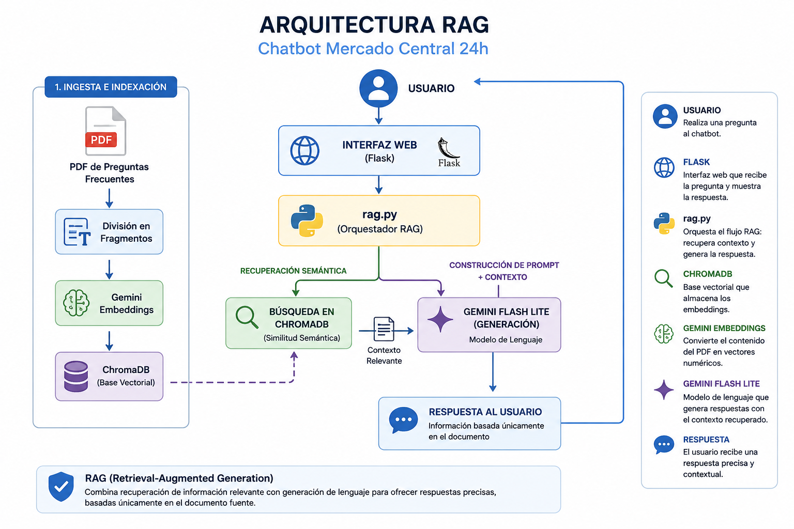
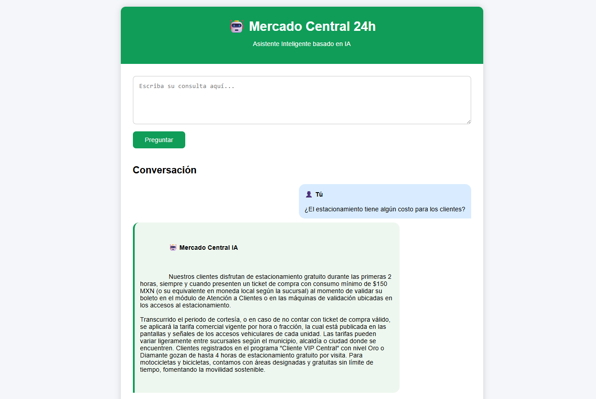
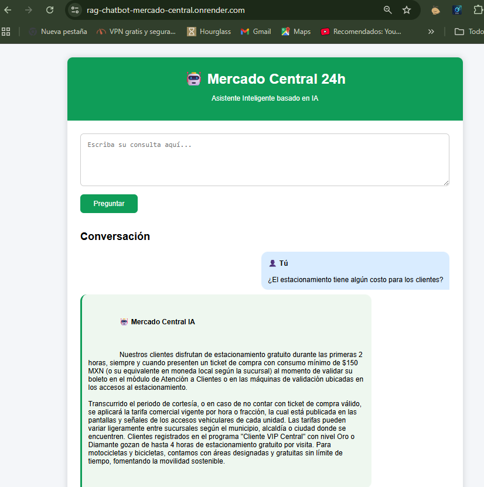

# 🤖 Chatbot RAG - Mercado Central 24h



Proyecto desarrollado como parte del **Challenge Alura Agente**, implementando un asistente virtual basado en la arquitectura **RAG (Retrieval-Augmented Generation)**.

El chatbot responde preguntas utilizando exclusivamente la información contenida en un documento PDF de preguntas frecuentes del Mercado Central 24h, recuperando el contexto más relevante mediante búsqueda semántica y generando respuestas con Google Gemini.

---

# 📌 Descripción

Este proyecto implementa una arquitectura **RAG (Retrieval-Augmented Generation)** que combina una base vectorial con un modelo de lenguaje para responder preguntas de forma precisa y fundamentada.

El flujo general del sistema es el siguiente:

1. Se carga un documento PDF con preguntas frecuentes.
2. El documento se divide en fragmentos.
3. Se generan embeddings utilizando **Gemini Embedding**.
4. Los embeddings se almacenan en **ChromaDB**.
5. Cuando un usuario realiza una consulta, se recuperan los fragmentos más relevantes.
6. Gemini Flash Lite genera una respuesta utilizando únicamente ese contexto.

De esta manera se evita que el modelo invente información y se garantiza que las respuestas provengan del documento indexado.

---

# ✨ Características

- ✅ Chat web desarrollado con Flask.
- ✅ Arquitectura RAG.
- ✅ Procesamiento automático de documentos PDF.
- ✅ Recuperación semántica mediante ChromaDB.
- ✅ Embeddings utilizando Gemini Embedding.
- ✅ Generación de respuestas con Gemini Flash Lite.
- ✅ Historial de conversación.
- ✅ Base vectorial persistente.
- ✅ Aplicación desplegada en la nube mediante Render.

---

# 🏗 Arquitectura de la solución


### Flujo del sistema

1. El documento PDF es procesado.
2. Se divide en fragmentos de texto.
3. Gemini Embedding convierte cada fragmento en vectores.
4. Los vectores se almacenan en ChromaDB.
5. El usuario realiza una consulta desde la interfaz web.
6. El Retriever recupera el contexto más relevante.
7. Se construye el prompt.
8. Gemini Flash Lite genera la respuesta.
9. El usuario recibe una respuesta basada únicamente en el documento.

---

# 🛠 Tecnologías utilizadas

- Python
- Flask
- LangChain
- ChromaDB
- Google Gemini Flash Lite
- Google Gemini Embedding
- PyPDF
- Render
- Git
- GitHub

---

# 📂 Estructura del proyecto

```text
Chatbot_Mercado_Central
│
├── app.py
├── rag.py
├── indexar.py
├── config.py
├── requirements.txt
├── README.md
│
├── chroma_db/
├── documentos/
│   └── preguntas frecuentes- mercado central.pdf
│
├── templates/
│   └── index.html
│
├── static/
│
└── assets/
    ├── arquitectura-rag.png
    ├── chatbot-demo.png
    └── deploy.png
```

---

# ⚙ Instalación

Clonar el repositorio:

```bash
git clone https://github.com/sergiosebastianalvarez2020/rag-chatbot-mercado-central.git
```

Ingresar al proyecto:

```bash
cd rag-chatbot-mercado-central
```

Crear un entorno virtual:

```bash
python -m venv venv
```

Activarlo:

### Windows

```bash
venv\Scripts\activate
```

### Linux / macOS

```bash
source venv/bin/activate
```

Instalar dependencias:

```bash
pip install -r requirements.txt
```

---

# 🔑 Configuración

Crear un archivo `.env` en la raíz del proyecto con la siguiente variable:

```text
GEMINI_API_KEY=TU_API_KEY
```

---

# 📄 Indexación del documento

Antes de ejecutar la aplicación es necesario generar la base vectorial.

Ejecutar:

```bash
python indexar.py
```

Este proceso:

- Lee el documento PDF.
- Divide el contenido en fragmentos.
- Genera embeddings con Gemini.
- Almacena los vectores en ChromaDB.

---

# ▶ Ejecutar la aplicación

```bash
python app.py
```

Abrir el navegador en:

```
http://localhost:5000
```

---

# 💬 Ejemplos de preguntas

- ¿Cuál es el horario de atención?
- ¿Aceptan tarjetas?
- ¿Hay estacionamiento?
- ¿Realizan envíos?
- ¿Dónde está ubicado el Mercado Central?
- ¿Qué servicios ofrece?

---

# 🤖 Ejemplo de respuesta

**Usuario**

> ¿Cuál es el horario de atención?

**Asistente**

> El Mercado Central 24h permanece abierto las 24 horas del día, los 7 días de la semana.

---

# ☁️ Deploy

La aplicación se encuentra desplegada en Render y puede probarse en el siguiente enlace:

**https://rag-chatbot-mercado-central.onrender.com**

---

# 📸 Evidencia del funcionamiento

## Chatbot respondiendo consultas



---

## Aplicación desplegada



---

# 🎯 Objetivos alcanzados

- ✔ Desarrollo de un agente inteligente basado en arquitectura RAG.
- ✔ Procesamiento e indexación de documentos PDF.
- ✔ Recuperación semántica mediante ChromaDB.
- ✔ Integración con Google Gemini.
- ✔ Aplicación web desarrollada con Flask.
- ✔ Despliegue en la nube.
- ✔ Código organizado y documentado.

---

# 🚀 Posibles mejoras

- Soporte para múltiples documentos.
- Carga de documentos desde la interfaz web.
- Memoria persistente entre sesiones.
- Mejoras visuales de la interfaz.
- Autenticación de usuarios.
- Historial de conversaciones almacenado en base de datos.

---

# 👨‍💻 Autor

**Sebastián Álvarez**

Proyecto desarrollado para el **Challenge Alura Agente** utilizando Python, Flask, LangChain, ChromaDB y Google Gemini.